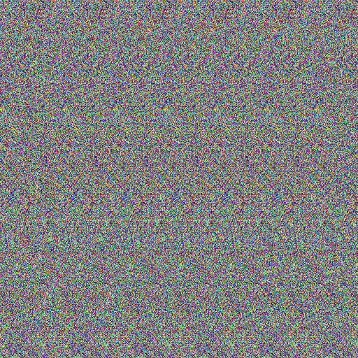

# Generating basic stereogram image with default settings

### Configuration

- Palette colors: `none` (_by default_)
- DPI: `72` (_by default_)
- Mask Transparent color: `none` (_by default_)

## Mask

## Result

